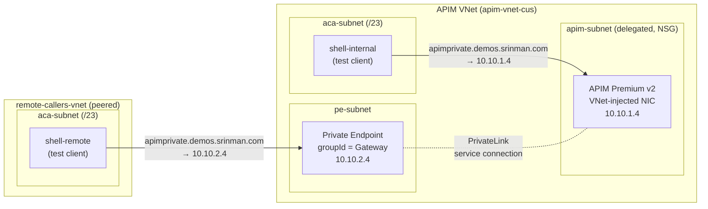
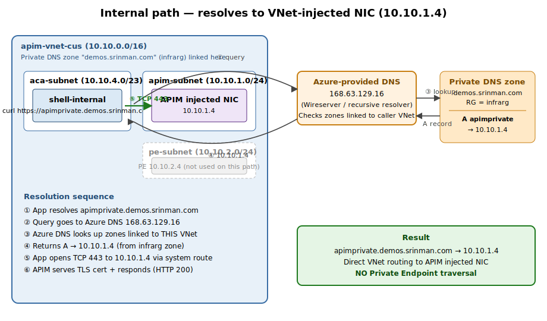
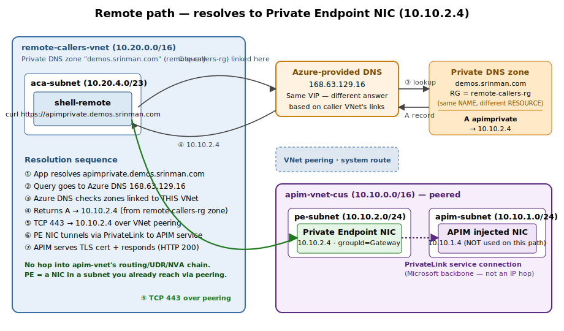

# APIM Premium v2 — VNet Injection + Private Endpoint (split-horizon DNS)

This guide deploys **API Management Premium v2** with **VNet injection** and adds a **Private Endpoint** for a second class of callers ("remote-callers") that must bypass NVAs/firewalls in the network path. A **custom domain** (`apimprivate.demos.srinman.com`) is used for both paths via **split-horizon Private DNS**.

> Target: one APIM instance, two private IPs, one hostname, two answers depending on where the caller sits.

This README reflects the **actual end-to-end deployment** performed against a real Azure subscription. The findings/gotchas section calls out every place the documented happy path differs from what works in practice.

---

## 1. Architecture



### Key facts that drive the design

| Concern | Behavior |
|---|---|
| APIM v2 VNet injection | Single delegated subnet using **`Microsoft.Web/hostingEnvironments`** delegation. A dedicated NSG on the subnet is **mandatory**. NIC gets a private IP in that subnet. |
| `virtualNetworkType` | **Cannot be changed after create** on PremiumV2 (`ChangingVnetTypeNotSupportedForPremiumV2`). Must be baked into the initial PUT. |
| Regional availability | PremiumV2 is regionally restricted **per subscription**. Probe before assuming. (For this sub: only `centralus`.) |
| Activation throttle | Subscription-wide **60-min cool-down** between PremiumV2 activations (`ServiceSkuActivationThrottled`). |
| `publicNetworkAccess=Disabled` | **Cannot be set at create** when VNet-injected (`ActivateServiceWithPrivateEndpointAccessNotAllowed`). PATCH it after the service is `Succeeded`. |
| Provisioning time | VNet-injected internal v2 is ~**13 min** (much faster than v1's 30–45). |
| Private Endpoint | `groupId` = **`Gateway`** only. Exposes the gateway data-plane. **Does NOT expose** developer portal, management, SCM, or direct management endpoints. |
| Custom hostname ownership | APIM **always** requires a **public CNAME** for `<custom-fqdn> → <apim-name>.azure-api.net` to prove ownership — there is **no override** for `.private`/`.local` TLDs. Use a real public DNS zone. |
| Custom hostname upload | Inline-PFX (`encodedCertificate` in ARM) often hangs ~47 min then silently rolls back. **Use a Key Vault cert reference** (set up via portal or `keyVaultId`) — it lands instantly. |
| Developer portal in private mode | Not reachable through the PE. Accessible only via the VNet-injected IP (or a custom dev-portal hostname pointed at the VNet-injected IP). Must enable `developerPortalStatus=Enabled` first. |
| Response field name | The runtime returns `privateIPAddresses` (capital `IP`). The CLI helper `--query privateIpAddresses` returns null due to camelCase mismatch — query the JSON directly. |

---

## 2. Prerequisites

- Subscription + permission to create APIM, VNets, PE, Private DNS zones, Key Vault, ACA.
- A **public DNS zone** you own (e.g., `demos.srinman.com`) where you can add a CNAME — APIM **requires** this for hostname ownership verification, even on a fully private deployment.
- Existing Key Vault (this guide uses `srinman` in `infrarg`).
- Azure CLI ≥ 2.61 (`az version`).

```bash
LOC=centralus                            # PremiumV2 availability varies per sub — probe!
APIM_RG=apim-rg
APIM_NAME=apim-priv-sm01                 # must be globally unique
APIM_VNET=apim-vnet-cus
APIM_SUBNET=apim-subnet                  # delegated subnet for APIM v2
PE_SUBNET=pe-subnet                      # subnet for the private endpoint NIC
ACA_SUBNET_APIM=aca-subnet               # /23 for ACA env in APIM VNet
REMOTE_RG=remote-callers-rg
REMOTE_VNET=remote-callers-vnet
REMOTE_SUBNET=clients
ACA_SUBNET_REMOTE=aca-subnet             # /23 for ACA env in remote VNet
INFRA_RG=infrarg
PUBLIC_DNS_ZONE=demos.srinman.com        # public Azure DNS zone you own
CUSTOM_HOST=apimprivate
CUSTOM_FQDN=${CUSTOM_HOST}.${PUBLIC_DNS_ZONE}
KV_NAME=srinman                          # Key Vault for cert
KV_CERT_NAME=apimprivate-demos-srinman-com
PUB_EMAIL=admin@srinman.com
PUB_NAME='Srinman'
SUB_ID=$(az account show --query id -o tsv)
```

**Probe PremiumV2 availability** in your candidate region(s) before committing:
```bash
az apim create -g $APIM_RG -n probe-$RANDOM -l $LOC \
  --sku-name PremiumV2 --sku-capacity 1 \
  --publisher-email "$PUB_EMAIL" --publisher-name "$PUB_NAME" \
  --no-wait 2>&1 | grep -i "not available\|SkuNotAvailable" \
  && echo "PremiumV2 NOT available in $LOC for this subscription"
```

---

## 3. Networking

### 3.1 APIM VNet + subnets + NSG

```bash
az group create -n $APIM_RG -l $LOC

az network vnet create -g $APIM_RG -n $APIM_VNET \
  --address-prefixes 10.10.0.0/16 \
  --subnet-name $APIM_SUBNET --subnet-prefixes 10.10.1.0/24

# --- NSG on the APIM-delegated subnet (REQUIRED) ---
az network nsg create -g $APIM_RG -n nsg-apim-subnet-cus -l $LOC

az network nsg rule create -g $APIM_RG --nsg-name nsg-apim-subnet-cus \
  -n allow-apim-mgmt --priority 100 \
  --source-address-prefixes ApiManagement --destination-port-ranges 3443 \
  --protocol Tcp --access Allow --direction Inbound

az network nsg rule create -g $APIM_RG --nsg-name nsg-apim-subnet-cus \
  -n allow-vnet-https --priority 110 \
  --source-address-prefixes VirtualNetwork --destination-port-ranges 443 \
  --protocol Tcp --access Allow --direction Inbound

az network nsg rule create -g $APIM_RG --nsg-name nsg-apim-subnet-cus \
  -n allow-azure-lb --priority 120 \
  --source-address-prefixes AzureLoadBalancer --destination-port-ranges '*' \
  --protocol '*' --access Allow --direction Inbound

# Delegate + attach NSG
az network vnet subnet update -g $APIM_RG --vnet-name $APIM_VNET -n $APIM_SUBNET \
  --delegations Microsoft.Web/hostingEnvironments \
  --network-security-group nsg-apim-subnet-cus

# PE subnet (no delegation, PE policies disabled)
az network vnet subnet create -g $APIM_RG --vnet-name $APIM_VNET \
  -n $PE_SUBNET --address-prefixes 10.10.2.0/24 \
  --private-endpoint-network-policies Disabled

# ACA env subnet (/23 with ACA delegation — used in §11 testing)
az network vnet subnet create -g $APIM_RG --vnet-name $APIM_VNET \
  -n $ACA_SUBNET_APIM --address-prefixes 10.10.4.0/23 \
  --delegations Microsoft.App/environments
```

### 3.2 Remote-callers VNet (peered to APIM VNet)

```bash
az group create -n $REMOTE_RG -l $LOC
az network vnet create -g $REMOTE_RG -n $REMOTE_VNET \
  --address-prefixes 10.20.0.0/16 \
  --subnet-name $REMOTE_SUBNET --subnet-prefixes 10.20.1.0/24

az network vnet subnet create -g $REMOTE_RG --vnet-name $REMOTE_VNET \
  -n $ACA_SUBNET_REMOTE --address-prefixes 10.20.4.0/23 \
  --delegations Microsoft.App/environments

# Peer both ways
az network vnet peering create -g $APIM_RG -n apim-to-remote \
  --vnet-name $APIM_VNET \
  --remote-vnet /subscriptions/$SUB_ID/resourceGroups/$REMOTE_RG/providers/Microsoft.Network/virtualNetworks/$REMOTE_VNET \
  --allow-vnet-access
az network vnet peering create -g $REMOTE_RG -n remote-to-apim \
  --vnet-name $REMOTE_VNET \
  --remote-vnet /subscriptions/$SUB_ID/resourceGroups/$APIM_RG/providers/Microsoft.Network/virtualNetworks/$APIM_VNET \
  --allow-vnet-access
```

> **Why peer if the whole point is to use a PE?** The PE NIC lives in the APIM VNet. Remote-callers reach the PE IP through VNet peering — pure system-route VNet routing — and **never touch the hub NVA chain** that the VNet-injected IP would be reached through. That is the bypass.

---

## 4. Deploy APIM Premium v2 (VNet injected, Internal)

`virtualNetworkType` can't be changed after the service exists, so set it in the **initial PUT**. Use REST directly (CLI's `az apim create` doesn't expose `virtualNetworkConfiguration` cleanly for v2).

```bash
APIM_SUBNET_ID=$(az network vnet subnet show -g $APIM_RG \
  --vnet-name $APIM_VNET -n $APIM_SUBNET --query id -o tsv)

az rest --method put \
  --uri "https://management.azure.com/subscriptions/$SUB_ID/resourceGroups/$APIM_RG/providers/Microsoft.ApiManagement/service/$APIM_NAME?api-version=2024-05-01" \
  --body "{
    \"location\":\"$LOC\",
    \"sku\":{\"name\":\"PremiumV2\",\"capacity\":1},
    \"identity\":{\"type\":\"SystemAssigned\"},
    \"properties\":{
      \"publisherEmail\":\"$PUB_EMAIL\",
      \"publisherName\":\"$PUB_NAME\",
      \"virtualNetworkType\":\"Internal\",
      \"virtualNetworkConfiguration\":{\"subnetResourceId\":\"$APIM_SUBNET_ID\"}
    }
  }"

# Wait until Succeeded (~13 min for v2 Internal+VNet)
while true; do
  s=$(az apim show -g $APIM_RG -n $APIM_NAME --query provisioningState -o tsv 2>/dev/null)
  echo "$(date +%T) provisioningState=$s"
  [[ "$s" == "Succeeded" ]] && break
  [[ "$s" == "Failed" ]]    && { echo "FAILED"; break; }
  sleep 60
done
```

Once `Succeeded`, **PATCH `publicNetworkAccess=Disabled`** (cannot be set at create):

```bash
az rest --method patch \
  --uri "https://management.azure.com/subscriptions/$SUB_ID/resourceGroups/$APIM_RG/providers/Microsoft.ApiManagement/service/$APIM_NAME?api-version=2024-05-01" \
  --body '{"properties":{"publicNetworkAccess":"Disabled"}}'
```

Capture the VNet-injected IP — note the **capital `IP`** in the field name:

```bash
APIM_PRIV_IP=$(az rest --method get \
  --uri "https://management.azure.com/subscriptions/$SUB_ID/resourceGroups/$APIM_RG/providers/Microsoft.ApiManagement/service/$APIM_NAME?api-version=2024-05-01" \
  --query 'properties.privateIPAddresses[0]' -o tsv)
echo "APIM VNet-injected IP: $APIM_PRIV_IP"   # e.g. 10.10.1.4
```

> **Gotcha:** `az apim show --query privateIpAddresses` returns `null` because of camelCase mismatch. Use the JSON path `privateIPAddresses` against the raw REST response.

---

## 5. Create the Private Endpoint (for remote-callers)

```bash
APIM_RES_ID=$(az apim show -g $APIM_RG -n $APIM_NAME --query id -o tsv)

az network private-endpoint create -g $APIM_RG -n pe-apim-gateway \
  --vnet-name $APIM_VNET --subnet $PE_SUBNET \
  --private-connection-resource-id $APIM_RES_ID \
  --group-id Gateway \
  --connection-name pe-apim-gateway-conn

PE_IP=$(az network private-endpoint show -g $APIM_RG -n pe-apim-gateway \
  --query 'customDnsConfigs[0].ipAddresses[0]' -o tsv)
echo "Private Endpoint IP: $PE_IP"   # e.g. 10.10.2.4
```

> The **groupId is `Gateway`**. This is the only group APIM v2 exposes today. Developer portal and management are intentionally not reachable via PE.

---

## 6. Public CNAME (ownership verification)

APIM verifies you own the custom hostname by resolving a public CNAME → `<apim-name>.azure-api.net`. **No exceptions** — even for an Internal-only, `publicNetworkAccess=Disabled` deployment.

```bash
az network dns record-set cname set-record -g $INFRA_RG -z $PUBLIC_DNS_ZONE \
  -n $CUSTOM_HOST -c "${APIM_NAME}.azure-api.net" --ttl 300

# Verify from anywhere on the public internet:
dig +short ${CUSTOM_FQDN}
# Expect: apim-priv-sm01.azure-api.net.
```

Without this, the hostname add will fail with `CNAME pointing to '<apim>.azure-api.net' must be provisioned for your custom domain name before it can be assigned to API Management service`.

---

## 7. TLS certificate via Key Vault

> **Use Key Vault, not inline PFX upload.** Inline `encodedCertificate` against v2 in our tests hung ~47 min then silently rolled back the hostname add. A KV reference lands instantly.

### 7.1 Create the cert in Key Vault

For testing, a KV-issued **self-signed** cert is the fastest path. For production, integrate a public CA (DigiCert, etc.) or your internal CA via KV's issuer config.

```bash
# Cert policy: self-signed, RSA 2048, SAN = custom FQDN, 24-month validity, auto-renew at 30 days remaining.
cat > kv-cert-policy.json <<EOF
{
  "issuerParameters": { "name": "Self" },
  "keyProperties": { "exportable": true, "keyType": "RSA", "keySize": 2048, "reuseKey": false },
  "secretProperties": { "contentType": "application/x-pkcs12" },
  "x509CertificateProperties": {
    "subject": "CN=${CUSTOM_FQDN}",
    "subjectAlternativeNames": { "dnsNames": ["${CUSTOM_FQDN}"] },
    "keyUsage": ["digitalSignature","keyEncipherment"],
    "ekus": ["1.3.6.1.5.5.7.3.1"],
    "validityInMonths": 24
  },
  "lifetimeActions": [
    { "trigger": {"daysBeforeExpiry": 30}, "action": {"actionType": "AutoRenew"} }
  ]
}
EOF

az keyvault certificate create --vault-name $KV_NAME -n $KV_CERT_NAME \
  --policy @kv-cert-policy.json
```

### 7.2 RBAC for APIM managed identity on the Key Vault

The APIM system-assigned MI was enabled in §4 (`"identity":{"type":"SystemAssigned"}`). Grant it the two roles required to read a KV cert from APIM:

```bash
APIM_MI_PRINCIPAL=$(az apim show -g $APIM_RG -n $APIM_NAME --query identity.principalId -o tsv)
KV_ID=$(az keyvault show -n $KV_NAME --query id -o tsv)

# Key Vault Secrets User
az role assignment create --assignee-object-id $APIM_MI_PRINCIPAL \
  --assignee-principal-type ServicePrincipal \
  --role "Key Vault Secrets User" --scope $KV_ID

# Key Vault Certificate User
az role assignment create --assignee-object-id $APIM_MI_PRINCIPAL \
  --assignee-principal-type ServicePrincipal \
  --role "Key Vault Certificate User" --scope $KV_ID
```

### 7.3 KV network access — make APIM reachable

If the KV has `publicNetworkAccess=Disabled` and APIM's VNet has no private DNS link to `privatelink.vaultcore.azure.net`, APIM cannot resolve the KV. Two options:

- **(A) Trusted-services bypass (quickest).** APIM is on the KV "Trusted Microsoft services" allow-list.
  ```bash
  az keyvault update -n $KV_NAME \
    --public-network-access Enabled \
    --default-action Deny \
    --bypass AzureServices
  ```
- **(B) Private endpoint for KV in (or peered to) the APIM VNet** + Private DNS link for `privatelink.vaultcore.azure.net`. Cleaner long-term, more infra to set up.

---

## 8. Add the custom hostname (Key Vault source)

The most reliable path is via the **portal**: APIM → *Custom domains* → *+Add* → type **Gateway**, hostname `apimprivate.demos.srinman.com`, **Certificate = Key vault**, select `$KV_NAME` / `$KV_CERT_NAME`, check *Default SSL binding*, *Save*.

CLI equivalent (PATCH with `keyVaultId` is the relevant property):

```bash
KV_CERT_SID=$(az keyvault certificate show --vault-name $KV_NAME -n $KV_CERT_NAME --query sid -o tsv)
# Strip the version so APIM auto-rolls on renewal:
KV_CERT_SID_UNVER=$(echo $KV_CERT_SID | awk -F/ '{ OFS="/"; NF=NF-1; print }')

az rest --method patch \
  --uri "https://management.azure.com/subscriptions/$SUB_ID/resourceGroups/$APIM_RG/providers/Microsoft.ApiManagement/service/$APIM_NAME?api-version=2024-05-01" \
  --body "{
    \"properties\":{
      \"hostnameConfigurations\":[
        {
          \"type\":\"Proxy\",
          \"hostName\":\"$CUSTOM_FQDN\",
          \"keyVaultId\":\"$KV_CERT_SID_UNVER\",
          \"identityClientId\":null,
          \"negotiateClientCertificate\":false,
          \"defaultSslBinding\":true
        }
      ]
    }
  }"
```

Verify:
```bash
az apim show -g $APIM_RG -n $APIM_NAME \
  --query "hostnameConfigurations[?type=='Proxy'].{host:hostName, src:certificateSource, def:defaultSslBinding}" -o table
# Expect: source=KeyVault, defaultSslBinding=true
```

---

## 9. Split-horizon Private DNS

Same FQDN must resolve to **two different IPs** depending on the caller's VNet. This works because:
1. A Private DNS zone is a unique Azure resource, but **two zones with the same NAME** can exist in different RGs.
2. Each Private DNS zone is **linked to specific VNet(s)**. A VNet may be linked to **at most one** zone of a given name.
3. The Azure DNS resolver (`168.63.129.16`) answers queries based on **which zone is linked to the caller's VNet**.

### 9.1 Internal path — APIM VNet → injected NIC (10.10.1.4)



```bash
# Private zone in infrarg (created once, may already exist)
az network private-dns zone create -g $INFRA_RG -n $PUBLIC_DNS_ZONE 2>/dev/null || true

az network private-dns record-set a add-record \
  -g $INFRA_RG -z $PUBLIC_DNS_ZONE -n $CUSTOM_HOST -a $APIM_PRIV_IP

az network private-dns link vnet create \
  -g $INFRA_RG -n link-apim-vnet -z $PUBLIC_DNS_ZONE \
  --virtual-network /subscriptions/$SUB_ID/resourceGroups/$APIM_RG/providers/Microsoft.Network/virtualNetworks/$APIM_VNET \
  --registration-enabled false
```

### 9.2 Remote path — remote-callers VNet → PE NIC (10.10.2.4)



```bash
# A SECOND zone with the SAME NAME, different RG
az network private-dns zone create -g $REMOTE_RG -n $PUBLIC_DNS_ZONE

az network private-dns record-set a add-record \
  -g $REMOTE_RG -z $PUBLIC_DNS_ZONE -n $CUSTOM_HOST -a $PE_IP

az network private-dns link vnet create \
  -g $REMOTE_RG -n link-remote-vnet -z $PUBLIC_DNS_ZONE \
  --virtual-network /subscriptions/$SUB_ID/resourceGroups/$REMOTE_RG/providers/Microsoft.Network/virtualNetworks/$REMOTE_VNET \
  --registration-enabled false
```

### 9.3 Resolution matrix

| Caller location | Linked zone | `apimprivate.demos.srinman.com` resolves to | Reaches APIM via |
|---|---|---|---|
| Anything in `apim-vnet-cus` (and peered VNets linked to the infrarg zone) | `infrarg/demos.srinman.com` | `10.10.1.4` | Injected NIC, system route |
| Anything in `remote-callers-vnet` | `remote-callers-rg/demos.srinman.com` | `10.10.2.4` | Private Endpoint NIC over VNet peering — **no NVA hop** |
| Public internet | The public zone (`infrarg/demos.srinman.com` Azure DNS) | A CNAME → `apim-priv-sm01.azure-api.net` whose A record is the regional VIP (and `publicNetworkAccess=Disabled` blocks it) | Blocked |
| On-prem | Conditional-forward to whichever Private Resolver inbound endpoint sits in the VNet whose answer you want | Matches that VNet's link | Same as that VNet |

> **Rule:** Never link both private zones to the same VNet. A VNet may have at most one effective record for a given name.

---

## 10. Developer portal in this model

The Private Endpoint **does not** expose the developer portal. Options:

1. **Internal access via the injected NIC.** Reach the portal from a jumpbox/Bastion VM inside a VNet that resolves the dev-portal hostname to `$APIM_PRIV_IP`.
2. **Custom dev-portal hostname** (e.g. `portal.demos.srinman.com`):
   - Public CNAME `portal → ${APIM_NAME}.developer.azure-api.net` for ownership.
   - **Enable dev portal first** (otherwise hostname add fails with `DeveloperPortalNotEnabledForCustomHostnames`):
     ```bash
     az rest --method patch \
       --uri "https://management.azure.com/subscriptions/$SUB_ID/resourceGroups/$APIM_RG/providers/Microsoft.ApiManagement/service/$APIM_NAME?api-version=2024-05-01" \
       --body '{"properties":{"developerPortalStatus":"Enabled"}}'
     ```
   - Then add a second `hostnameConfigurations[]` entry with `"type":"DeveloperPortal"` referencing a KV cert whose SAN matches `portal.demos.srinman.com`.
   - Internal private DNS A record `portal → $APIM_PRIV_IP` in the infrarg zone only — do **not** publish it through the PE zone.
3. **External access** via App Gateway / Front Door in front of the injected NIC — out of scope here.

Remote-callers are API consumers — they don't need the portal. Provide them with the OpenAPI spec or a hosted catalog.

---

## 11. Testing with ACA shell containers

The cleanest in-VNet test client is a tiny **Azure Container Apps** container running `nicolaka/netshoot` (`dig`, `curl`, `openssl`, etc.) in each VNet. No VM, no Bastion, no SSH keys.

### 11.1 Deploy two ACA environments + shells

```bash
# APIM-side ACA env + shell
az containerapp env create -g $APIM_RG -n aca-env-internal -l $LOC \
  --infrastructure-subnet-resource-id $(az network vnet subnet show -g $APIM_RG --vnet-name $APIM_VNET -n $ACA_SUBNET_APIM --query id -o tsv) \
  --internal-only true --enable-workload-profiles true

az containerapp create -g $APIM_RG -n shell-internal \
  --environment aca-env-internal \
  --image nicolaka/netshoot:latest \
  --command "sleep" --args "infinity" \
  --min-replicas 1 --max-replicas 1

# Remote-side ACA env + shell
az containerapp env create -g $REMOTE_RG -n aca-env-remote -l $LOC \
  --infrastructure-subnet-resource-id $(az network vnet subnet show -g $REMOTE_RG --vnet-name $REMOTE_VNET -n $ACA_SUBNET_REMOTE --query id -o tsv) \
  --internal-only true --enable-workload-profiles true

az containerapp create -g $REMOTE_RG -n shell-remote \
  --environment aca-env-remote \
  --image nicolaka/netshoot:latest \
  --command "sleep" --args "infinity" \
  --min-replicas 1 --max-replicas 1
```

> `az containerapp exec` requires a TTY. Wrap CLI calls in `script -qec "<cmd>" /dev/null` when running from a non-interactive shell.

### 11.2 Run the matrix

```bash
test_from_shell() {
  local rg=$1 app=$2
  script -qec "az containerapp exec -g $rg -n $app \
    --command 'sh -c \"dig +short ${CUSTOM_FQDN}; \
      curl -sk --max-time 10 -o /dev/null \
        -w http=%{http_code}\\nip=%{remote_ip}\\n \
        https://${CUSTOM_FQDN}/status-0123456789abcdef; \
      echo | openssl s_client -servername ${CUSTOM_FQDN} \
        -connect ${CUSTOM_FQDN}:443 2>/dev/null \
        | openssl x509 -noout -subject -issuer\"'" /dev/null
}

test_from_shell apim-rg          shell-internal   # expect ip=10.10.1.4, http=200
test_from_shell remote-callers-rg shell-remote     # expect ip=10.10.2.4, http=200
```

Expected output (both):
```
apimprivate.demos.srinman.com → <expected IP per VNet>
http=200
ip=<expected IP per VNet>
subject=CN=apimprivate.demos.srinman.com
issuer=CN=apimprivate.demos.srinman.com    # self-signed; would be the CA name for a CA-issued cert
```

- `http=200` confirms TLS handshake + APIM gateway returning the platform `/status-0123456789abcdef` probe.
- `ssl_verify_result` will be `18` (`X509_V_ERR_SELF_SIGNED_CERT_IN_CHAIN`) with a self-signed KV cert. That is a **client trust** issue, not an APIM/PE/DNS issue. Use `-k` to skip in testing; in prod, use a CA-issued cert or distribute the issuing CA to all callers.
- Compare `ip=` between the two shells — that is your **proof of split-horizon**.

### 11.3 Manual demo — prove APIM serves the KV cert via SNI on both paths

Open two terminals, one for each VNet:

```bash
# Terminal 1 — Internal VNet
az containerapp exec -g apim-rg -n shell-internal --command sh

# Terminal 2 — Remote VNet
az containerapp exec -g remote-callers-rg -n shell-remote --command sh
```

Inside each container, run this one-liner:

```bash
echo | openssl s_client -servername apimprivate.demos.srinman.com \
  -connect apimprivate.demos.srinman.com:443 2>/dev/null \
  | openssl x509 -noout -subject -issuer -dates && \
  getent hosts apimprivate.demos.srinman.com
```

**What this command does, piece by piece:**

| Fragment | Purpose |
|---|---|
| `echo \|` | Sends an empty stdin so `openssl s_client` exits immediately after the TLS handshake completes (otherwise it would sit waiting for HTTP input). |
| `openssl s_client` | Opens a raw TLS connection — no HTTP — so we see **exactly what the server presents at the TLS layer**. |
| `-servername apimprivate.demos.srinman.com` | Sends this name in the TLS **SNI** extension. APIM uses SNI to pick which hostname configuration (and therefore which cert) to serve. This is the key bit — we're proving the SNI-selected cert is our KV cert. |
| `-connect apimprivate.demos.srinman.com:443` | TCP target. Resolved via the container's DNS, which goes to `168.63.129.16` → the Private DNS zone linked to this VNet → returns `10.10.1.4` or `10.10.2.4` depending on which shell you're in. |
| `2>/dev/null` | Hides `openssl`'s noisy handshake log on stderr; the cert (PEM) still flows on stdout. |
| `\| openssl x509 -noout -subject -issuer -dates` | Parses the server cert from the pipe and prints just *Subject*, *Issuer*, and validity dates. `-noout` suppresses the raw PEM dump. |
| `&& getent hosts ...` | After the cert dump succeeds, runs the container's name-service resolver and prints `<IP>  <name>` — confirms which IP DNS handed back **in this VNet**. Using `getent` (not `dig`) means it goes through `/etc/nsswitch.conf` exactly the way a real application would. |

So the one command proves three things at once: (1) DNS in this VNet resolves to the expected private IP, (2) TCP 443 reaches that IP, (3) the TLS server at that IP presents the **custom-domain KV cert** when we ask for it by SNI.

Expected output — **different IP per shell, identical cert** served by APIM:

```
subject=CN = apimprivate.demos.srinman.com
issuer=CN  = apimprivate.demos.srinman.com
notBefore=...
notAfter=...
10.10.1.4   apimprivate.demos.srinman.com   ← shell-internal
10.10.2.4   apimprivate.demos.srinman.com   ← shell-remote
```

Optional — show the SAN to prove SNI-served cert matches the custom hostname (not the regional `*.azure-api.net`):

```bash
echo | openssl s_client -servername apimprivate.demos.srinman.com \
  -connect apimprivate.demos.srinman.com:443 2>/dev/null \
  | openssl x509 -noout -ext subjectAltName
```

---

## 12. Operational checklist

- [ ] `provisioningState=Succeeded`, `virtualNetworkType=Internal`, `publicNetworkAccess=Disabled`.
- [ ] `properties.privateIPAddresses[0]` recorded (note capital `IP`).
- [ ] PE in `Approved`, `customDnsConfigs[0].ipAddresses[0]` recorded.
- [ ] Public CNAME `${CUSTOM_HOST}` → `${APIM_NAME}.azure-api.net` resolves on the internet.
- [ ] KV cert created, APIM MI has *Key Vault Secrets User* + *Key Vault Certificate User*, KV reachable from APIM (trusted-services bypass or PE).
- [ ] Custom hostname shows `source=KeyVault`, `defaultSslBinding=true`.
- [ ] Two Private DNS zones with same name; **each linked only to its own VNet set**.
- [ ] A-record TTL ≤ 300 s during cut-over.
- [ ] NSG on `apim-subnet` present with `ApiManagement→3443`, `VirtualNetwork→443`, `AzureLoadBalancer→*`.
- [ ] Remote-callers UDRs (if any) do not divert `pe-subnet` prefix away from VNet peering.
- [ ] Dev-portal hostname (if used) only in the **internal** private zone.

---

## 13. Gotchas (real-world, every one of these bit us)

1. **PremiumV2 regional availability is subscription-specific.** Probe first; don't assume eastus/eastus2. This sub only supports it in `centralus`.
2. **NSG on the delegated subnet is mandatory.** APIM v2 won't provision without it.
3. **`virtualNetworkType` is immutable post-create.** Bake `Internal` + `virtualNetworkConfiguration` into the initial PUT.
4. **`publicNetworkAccess=Disabled` cannot be set at create** alongside VNet injection. Create first, PATCH after Succeeded.
5. **60-minute subscription-wide activation throttle** between PremiumV2 ops. Plan retries accordingly.
6. **Response field is `privateIPAddresses` (capital IP).** `az apim show --query privateIpAddresses` returns null. Use raw REST.
7. **Public CNAME is required for hostname ownership** — there is no escape hatch for `.private`/`.local` TLDs. Use a public domain you own.
8. **Inline-PFX hostname add can hang ~47 min and silently roll back** on v2. Use **Key Vault cert reference** (portal or `keyVaultId`).
9. **Developer portal hostname requires `developerPortalStatus=Enabled` first** (`DeveloperPortalNotEnabledForCustomHostnames`).
10. **Same-name Private DNS zones must live in different RGs.** Two zones with identical names in the same RG is not allowed.
11. **One zone per VNet per name.** Linking both same-name zones to the same VNet is rejected.
12. **PE only exposes `Gateway`.** Anything else (devportal, mgmt, SCM, direct-mgmt) still requires the injected NIC.
13. **Cert SAN must match the custom hostname**, not the regional `*.azure-api.net` default.
14. **NVA bypass only works if route tables on the remote-callers subnet route `10.10.2.0/24` directly via VNet peering** (system route). If a UDR forces `0.0.0.0/0` to the firewall, override it with a more-specific UDR for the PE subnet prefix pointing to `VirtualNetwork` next-hop.
15. **PE IP can change** if you delete/recreate the PE. Pin DNS to whatever `customDnsConfigs[0].ipAddresses[0]` reports and automate the A-record update.
16. **`az containerapp exec` needs a TTY** — wrap calls in `script -qec "..." /dev/null` from non-interactive shells.
17. **ACA env workload-profile internal needs a `/23` subnet** delegated `Microsoft.App/environments`.

---

## 14. Teardown

```bash
# ACA test resources
az containerapp delete -g $APIM_RG -n shell-internal -y
az containerapp delete -g $REMOTE_RG -n shell-remote -y
az containerapp env delete -g $APIM_RG -n aca-env-internal -y
az containerapp env delete -g $REMOTE_RG -n aca-env-remote -y

# Private DNS + PE
az network private-endpoint delete -g $APIM_RG -n pe-apim-gateway
az network private-dns link vnet delete -g $REMOTE_RG -n link-remote-vnet -z $PUBLIC_DNS_ZONE -y
az network private-dns zone delete    -g $REMOTE_RG -n $PUBLIC_DNS_ZONE -y
az network private-dns record-set a delete -g $INFRA_RG -z $PUBLIC_DNS_ZONE -n $CUSTOM_HOST -y
az network private-dns link vnet delete -g $INFRA_RG -n link-apim-vnet -z $PUBLIC_DNS_ZONE -y

# KV cert (optional — kept by soft-delete for 90 days)
az keyvault certificate delete --vault-name $KV_NAME -n $KV_CERT_NAME

# Public CNAME
az network dns record-set cname remove-record -g $INFRA_RG -z $PUBLIC_DNS_ZONE \
  -n $CUSTOM_HOST -c "${APIM_NAME}.azure-api.net"

# APIM + RGs
az apim delete -g $APIM_RG -n $APIM_NAME -y --no-wait
az group delete -n $REMOTE_RG -y --no-wait
az group delete -n $APIM_RG -y --no-wait
```
